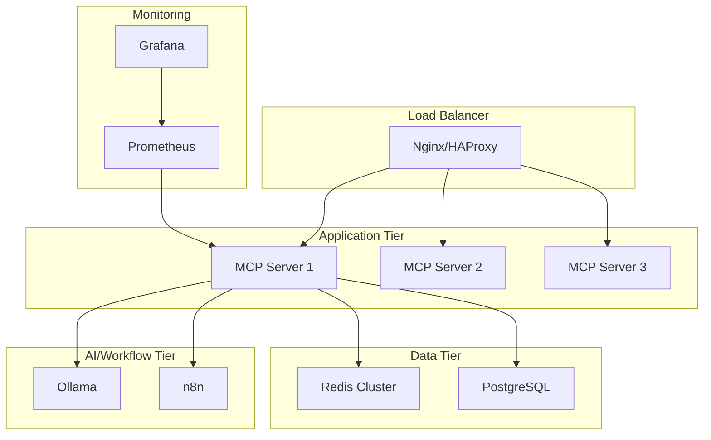

# Deployment Guide

This guide covers various deployment scenarios for the Proxmox MCP Server, from development to production environments.

## 🏗️ Deployment Architecture



## 🚀 Quick Start (Development)

### Prerequisites
- Docker 20.10+
- Docker Compose 2.0+
- 4GB+ RAM
- 20GB+ disk space

### Single-Node Development Setup

```bash
# Clone repository
git clone https://github.com/your-org/proxmox-mcp-server.git
cd proxmox-mcp-server

# Configure environment
cp config/.env.example config/.env
nano config/.env  # Edit with your settings

# Start development stack
docker-compose up -d

# Check status
docker-compose ps

# View logs
docker-compose logs -f proxmox-mcp-server
```

### Development Configuration

```bash
# config/.env for development
PROXMOX_HOST=192.168.1.100
PROXMOX_USERNAME=root@pam
PROXMOX_PASSWORD=your-password
PROXMOX_VERIFY_SSL=false

SECRET_KEY=dev-secret-key-change-in-production
LOG_LEVEL=DEBUG

ENABLE_AI_FEATURES=true
ENABLE_N8N_INTEGRATION=true

# Development database
POSTGRES_DB=proxmox_mcp_dev
POSTGRES_USER=dev_user
POSTGRES_PASSWORD=dev_password
```

## 🏢 Production Deployment

### Hardware Requirements

#### Minimum Requirements
- **CPU**: 4 cores (8 threads)
- **RAM**: 8GB
- **Storage**: 100GB SSD
- **Network**: 1Gbps

#### Recommended Requirements
- **CPU**: 8 cores (16 threads)
- **RAM**: 16GB (32GB with AI features)
- **Storage**: 500GB NVMe SSD
- **Network**: 10Gbps
- **GPU**: NVIDIA GPU for AI features (optional)

### Production Docker Compose

```yaml
# docker-compose.prod.yml
version: '3.8'

services:
  proxmox-mcp-server:
    image: proxmox-mcp-server:latest
    deploy:
      replicas: 3
      restart_policy:
        condition: on-failure
        max_attempts: 3
      resources:
        limits:
          cpus: '2.0'
          memory: 4G
        reservations:
          cpus: '1.0'
          memory: 2G
    environment:
      - NODE_ENV=production
      - LOG_LEVEL=INFO
    secrets:
      - proxmox_password
      - jwt_secret
    networks:
      - frontend
      - backend
    healthcheck:
      test: ["CMD", "curl", "-f", "http://localhost:8080/health"]
      interval: 30s
      timeout: 10s
      retries: 3
      start_period: 60s

  nginx:
    image: nginx:alpine
    ports:
      - "80:80"
      - "443:443"
    volumes:
      - ./config/nginx/prod.conf:/etc/nginx/nginx.conf:ro
      - ./config/ssl:/etc/nginx/ssl:ro
    depends_on:
      - proxmox-mcp-server
    networks:
      - frontend

secrets:
  proxmox_password:
    external: true
  jwt_secret:
    external: true

networks:
  frontend:
    external: true
  backend:
    external: true
```

### SSL Certificate Setup

#### Let's Encrypt with Certbot

```bash
# Install certbot
sudo apt-get update
sudo apt-get install certbot python3-certbot-nginx

# Generate certificates
sudo certbot certonly --standalone \
  -d proxmox-mcp.yourdomain.com \
  -d n8n.yourdomain.com \
  -d grafana.yourdomain.com

# Set up auto-renewal
sudo crontab -e
# Add: 0 12 * * * /usr/bin/certbot renew --quiet
```

#### Custom CA Certificates

```bash
# Generate CA private key
openssl genrsa -out ca-key.pem 4096

# Generate CA certificate
openssl req -new -x509 -days 365 -key ca-key.pem -sha256 -out ca.pem

# Generate server private key
openssl genrsa -out server-key.pem 4096

# Generate server certificate signing request
openssl req -subj "/CN=proxmox-mcp.yourdomain.com" -sha256 -new -key server-key.pem -out server.csr

# Generate server certificate
openssl x509 -req -days 365 -sha256 -in server.csr -CA ca.pem -CAkey ca-key.pem -out server-cert.pem -CAcreateserial

# Copy to nginx directory
cp server-cert.pem config/nginx/ssl/proxmox-mcp.crt
cp server-key.pem config/nginx/ssl/proxmox-mcp.key
```

### Production Environment Configuration

```bash
# config/.env.prod
# Proxmox Configuration
PROXMOX_HOST=proxmox.internal.com
PROXMOX_USERNAME=mcp-service@pve
PROXMOX_PASSWORD_FILE=/run/secrets/proxmox_password
PROXMOX_VERIFY_SSL=true
PROXMOX_TIMEOUT=60

# Security
SECRET_KEY_FILE=/run/secrets/jwt_secret
JWT_EXPIRE_MINUTES=30
ENABLE_RBAC=true

# Logging
LOG_LEVEL=INFO
LOG_FILE=/var/log/proxmox-mcp-server.log

# Performance
MAX_CONCURRENT_OPERATIONS=20
OPERATION_TIMEOUT=600

# Monitoring
ENABLE_METRICS=true
METRICS_PORT=9090

# AI Features (optional)
ENABLE_AI_FEATURES=true
OLLAMA_HOST=http://ollama-cluster:11434
OLLAMA_MODEL=llama2

# Workflow Automation
ENABLE_N8N_INTEGRATION=true
N8N_HOST=http://n8n-cluster:5678

# Database
DB_HOST=postgres-cluster
DB_PORT=5432
DB_NAME=proxmox_mcp_prod
DB_USER=proxmox_mcp
DB_PASSWORD_FILE=/run/secrets/db_password

# Redis
REDIS_HOST=redis-cluster
REDIS_PORT=6379
REDIS_PASSWORD_FILE=/run/secrets/redis_password
```

## ☸️ Kubernetes Deployment

### Namespace and Resources

```yaml
# namespace.yaml
apiVersion: v1
kind: Namespace
metadata:
  name: proxmox-mcp
  labels:
    name: proxmox-mcp
---
apiVersion: v1
kind: ResourceQuota
metadata:
  name: proxmox-mcp-quota
  namespace: proxmox-mcp
spec:
  hard:
    requests.cpu: "10"
    requests.memory: 20Gi
    limits.cpu: "20"
    limits.memory: 40Gi
    persistentvolumeclaims: "10"
```

### ConfigMap and Secrets

```yaml
# configmap.yaml
apiVersion: v1
kind: ConfigMap
metadata:
  name: proxmox-mcp-config
  namespace: proxmox-mcp
data:
  PROXMOX_HOST: "proxmox.internal.com"
  PROXMOX_PORT: "8006"
  PROXMOX_VERIFY_SSL: "true"
  LOG_LEVEL: "INFO"
  ENABLE_AI_FEATURES: "true"
  ENABLE_N8N_INTEGRATION: "true"
---
apiVersion: v1
kind: Secret
metadata:
  name: proxmox-mcp-secrets
  namespace: proxmox-mcp
type: Opaque
data:
  proxmox-username: cm9vdEBwYW0=  # base64 encoded
  proxmox-password: eW91ci1wYXNzd29yZA==
  jwt-secret: eW91ci1qd3Qtc2VjcmV0
```

### Deployment

```yaml
# deployment.yaml
apiVersion: apps/v1
kind: Deployment
metadata:
  name: proxmox-mcp-server
  namespace: proxmox-mcp
  labels:
    app: proxmox-mcp-server
spec:
  replicas: 3
  selector:
    matchLabels:
      app: proxmox-mcp-server
  template:
    metadata:
      labels:
        app: proxmox-mcp-server
    spec:
      containers:
      - name: proxmox-mcp-server
        image: proxmox-mcp-server:latest
        ports:
        - containerPort: 8080
          name: http
        - containerPort: 9090
          name: metrics
        env:
        - name: PROXMOX_HOST
          valueFrom:
            configMapKeyRef:
              name: proxmox-mcp-config
              key: PROXMOX_HOST
        - name: PROXMOX_USERNAME
          valueFrom:
            secretKeyRef:
              name: proxmox-mcp-secrets
              key: proxmox-username
        - name: PROXMOX_PASSWORD
          valueFrom:
            secretKeyRef:
              name: proxmox-mcp-secrets
              key: proxmox-password
        - name: SECRET_KEY
          valueFrom:
            secretKeyRef:
              name: proxmox-mcp-secrets
              key: jwt-secret
        resources:
          requests:
            cpu: 500m
            memory: 1Gi
          limits:
            cpu: 2
            memory: 4Gi
        livenessProbe:
          httpGet:
            path: /health
            port: 8080
          initialDelaySeconds: 30
          periodSeconds: 10
        readinessProbe:
          httpGet:
            path: /ready
            port: 8080
          initialDelaySeconds: 5
          periodSeconds: 5
        volumeMounts:
        - name: config
          mountPath: /app/config
          readOnly: true
        - name: logs
          mountPath: /var/log
      volumes:
      - name: config
        configMap:
          name: proxmox-mcp-config
      - name: logs
        emptyDir: {}
      securityContext:
        runAsNonRoot: true
        runAsUser: 1000
        fsGroup: 1000
```

### Service and Ingress

```yaml
# service.yaml
apiVersion: v1
kind: Service
metadata:
  name: proxmox-mcp-service
  namespace: proxmox-mcp
  labels:
    app: proxmox-mcp-server
spec:
  selector:
    app: proxmox-mcp-server
  ports:
  - name: http
    port: 80
    targetPort: 8080
  - name: metrics
    port: 9090
    targetPort: 9090
  type: ClusterIP
---
apiVersion: networking.k8s.io/v1
kind: Ingress
metadata:
  name: proxmox-mcp-ingress
  namespace: proxmox-mcp
  annotations:
    kubernetes.io/ingress.class: nginx
    cert-manager.io/cluster-issuer: letsencrypt-prod
    nginx.ingress.kubernetes.io/rate-limit: "100"
    nginx.ingress.kubernetes.io/rate-limit-window: "1m"
spec:
  tls:
  - hosts:
    - proxmox-mcp.yourdomain.com
    secretName: proxmox-mcp-tls
  rules:
  - host: proxmox-mcp.yourdomain.com
    http:
      paths:
      - path: /
        pathType: Prefix
        backend:
          service:
            name: proxmox-mcp-service
            port:
              number: 80
```

### Horizontal Pod Autoscaler

```yaml
# hpa.yaml
apiVersion: autoscaling/v2
kind: HorizontalPodAutoscaler
metadata:
  name: proxmox-mcp-hpa
  namespace: proxmox-mcp
spec:
  scaleTargetRef:
    apiVersion: apps/v1
    kind: Deployment
    name: proxmox-mcp-server
  minReplicas: 3
  maxReplicas: 10
  metrics:
  - type: Resource
    resource:
      name: cpu
      target:
        type: Utilization
        averageUtilization: 70
  - type: Resource
    resource:
      name: memory
      target:
        type: Utilization
        averageUtilization: 80
```

## 🔄 High Availability Setup

### Load Balancer Configuration

#### HAProxy

```bash
# /etc/haproxy/haproxy.cfg
global
    daemon
    maxconn 4096
    log stdout local0

defaults
    mode http
    timeout connect 5000ms
    timeout client 50000ms
    timeout server 50000ms
    option httplog

frontend proxmox_mcp_frontend
    bind *:80
    bind *:443 ssl crt /etc/ssl/certs/proxmox-mcp.pem
    redirect scheme https if !{ ssl_fc }
    
    # Rate limiting
    stick-table type ip size 100k expire 30s store http_req_rate(10s)
    http-request track-sc0 src
    http-request reject if { sc_http_req_rate(0) gt 20 }
    
    default_backend proxmox_mcp_backend

backend proxmox_mcp_backend
    balance roundrobin
    option httpchk GET /health
    
    server mcp1 10.0.1.10:8080 check
    server mcp2 10.0.1.11:8080 check
    server mcp3 10.0.1.12:8080 check
```

#### Nginx Load Balancer

```nginx
# /etc/nginx/nginx.conf
upstream proxmox_mcp_backend {
    least_conn;
    server 10.0.1.10:8080 max_fails=3 fail_timeout=30s;
    server 10.0.1.11:8080 max_fails=3 fail_timeout=30s;
    server 10.0.1.12:8080 max_fails=3 fail_timeout=30s;
}

server {
    listen 443 ssl http2;
    server_name proxmox-mcp.yourdomain.com;
    
    ssl_certificate /etc/ssl/certs/proxmox-mcp.crt;
    ssl_certificate_key /etc/ssl/private/proxmox-mcp.key;
    
    location / {
        proxy_pass http://proxmox_mcp_backend;
        proxy_set_header Host $host;
        proxy_set_header X-Real-IP $remote_addr;
        proxy_set_header X-Forwarded-For $proxy_add_x_forwarded_for;
        proxy_set_header X-Forwarded-Proto $scheme;
        
        # Health check
        proxy_next_upstream error timeout invalid_header http_500 http_502 http_503;
        proxy_connect_timeout 5s;
        proxy_send_timeout 60s;
        proxy_read_timeout 60s;
    }
    
    location /health {
        proxy_pass http://proxmox_mcp_backend/health;
        access_log off;
    }
}
```

### Database High Availability

#### PostgreSQL Cluster (Patroni)

```yaml
# patroni.yml
scope: proxmox-mcp-cluster
namespace: /proxmox-mcp/
name: postgres-1

restapi:
  listen: 0.0.0.0:8008
  connect_address: 10.0.1.20:8008

etcd:
  hosts: 10.0.1.30:2379,10.0.1.31:2379,10.0.1.32:2379

bootstrap:
  dcs:
    ttl: 30
    loop_wait: 10
    retry_timeout: 30
    maximum_lag_on_failover: 1048576
    postgresql:
      use_pg_rewind: true
      parameters:
        max_connections: 200
        shared_preload_libraries: pg_stat_statements
        wal_level: replica
        hot_standby: "on"
        wal_keep_segments: 8
        max_wal_senders: 10
        max_replication_slots: 10

  initdb:
  - encoding: UTF8
  - data-checksums

postgresql:
  listen: 0.0.0.0:5432
  connect_address: 10.0.1.20:5432
  data_dir: /var/lib/postgresql/data
  bin_dir: /usr/lib/postgresql/13/bin
  authentication:
    replication:
      username: replicator
      password: replicator-password
    superuser:
      username: postgres
      password: postgres-password
```

#### Redis Cluster

```bash
# Redis cluster setup
redis-cli --cluster create \
  10.0.1.40:6379 10.0.1.41:6379 10.0.1.42:6379 \
  10.0.1.43:6379 10.0.1.44:6379 10.0.1.45:6379 \
  --cluster-replicas 1
```

## 📊 Monitoring and Observability

### Prometheus Configuration

```yaml
# prometheus.yml
global:
  scrape_interval: 15s
  evaluation_interval: 15s

rule_files:
  - "proxmox_mcp_rules.yml"

scrape_configs:
  - job_name: 'proxmox-mcp-server'
    static_configs:
      - targets: ['10.0.1.10:9090', '10.0.1.11:9090', '10.0.1.12:9090']
    scrape_interval: 30s
    metrics_path: /metrics

  - job_name: 'haproxy'
    static_configs:
      - targets: ['10.0.1.5:8404']

  - job_name: 'postgres'
    static_configs:
      - targets: ['10.0.1.20:9187', '10.0.1.21:9187', '10.0.1.22:9187']

  - job_name: 'redis'
    static_configs:
      - targets: ['10.0.1.40:9121', '10.0.1.41:9121', '10.0.1.42:9121']

alerting:
  alertmanagers:
    - static_configs:
        - targets:
          - alertmanager:9093
```

### Grafana Dashboards

```json
{
  "dashboard": {
    "title": "Proxmox MCP Server Overview",
    "panels": [
      {
        "title": "Request Rate",
        "type": "graph",
        "targets": [
          {
            "expr": "rate(http_requests_total[5m])",
            "legendFormat": "{{instance}}"
          }
        ]
      },
      {
        "title": "Response Time",
        "type": "graph",
        "targets": [
          {
            "expr": "histogram_quantile(0.95, rate(http_request_duration_seconds_bucket[5m]))",
            "legendFormat": "95th percentile"
          }
        ]
      },
      {
        "title": "Error Rate",
        "type": "singlestat",
        "targets": [
          {
            "expr": "rate(http_requests_total{status=~\"5..\"}[5m]) / rate(http_requests_total[5m])",
            "legendFormat": "Error Rate"
          }
        ]
      }
    ]
  }
}
```

## 🔄 Backup and Disaster Recovery

### Backup Strategy

```bash
#!/bin/bash
# backup.sh

# Database backup
pg_dump -h postgres-cluster -U proxmox_mcp proxmox_mcp_prod > backup/db_$(date +%Y%m%d_%H%M%S).sql

# Configuration backup
tar -czf backup/config_$(date +%Y%m%d_%H%M%S).tar.gz config/

# Docker volumes backup
docker run --rm -v proxmox-mcp-server_data:/data -v $(pwd)/backup:/backup alpine tar czf /backup/volumes_$(date +%Y%m%d_%H%M%S).tar.gz /data

# Upload to S3
aws s3 sync backup/ s3://proxmox-mcp-backups/$(date +%Y/%m/%d)/

# Cleanup old backups (keep 30 days)
find backup/ -name "*.sql" -mtime +30 -delete
find backup/ -name "*.tar.gz" -mtime +30 -delete
```

### Disaster Recovery Plan

1. **Recovery Time Objective (RTO)**: 4 hours
2. **Recovery Point Objective (RPO)**: 1 hour

#### Recovery Procedures

```bash
# 1. Restore infrastructure
terraform apply -var-file="disaster-recovery.tfvars"

# 2. Restore database
psql -h new-postgres-cluster -U proxmox_mcp -d proxmox_mcp_prod < backup/latest_db.sql

# 3. Restore configuration
tar -xzf backup/latest_config.tar.gz

# 4. Restore volumes
docker run --rm -v new_data_volume:/data -v $(pwd)/backup:/backup alpine tar xzf /backup/latest_volumes.tar.gz -C /

# 5. Start services
docker-compose -f docker-compose.prod.yml up -d

# 6. Verify functionality
curl -f https://proxmox-mcp.yourdomain.com/health
```

## 🧪 Testing Deployments

### Smoke Tests

```bash
#!/bin/bash
# smoke_test.sh

BASE_URL="https://proxmox-mcp.yourdomain.com"

# Health check
echo "Testing health endpoint..."
curl -f "$BASE_URL/health" || exit 1

# Authentication
echo "Testing authentication..."
TOKEN=$(curl -s -X POST "$BASE_URL/api/v1/auth/login" \
  -H "Content-Type: application/json" \
  -d '{"username":"test","password":"test"}' | jq -r '.access_token')

# API endpoints
echo "Testing API endpoints..."
curl -f -H "Authorization: Bearer $TOKEN" "$BASE_URL/api/v1/cluster/status" || exit 1
curl -f -H "Authorization: Bearer $TOKEN" "$BASE_URL/api/v1/vms" || exit 1

echo "All tests passed!"
```

### Load Testing

```bash
# Using Apache Bench
ab -n 1000 -c 10 -H "Authorization: Bearer $TOKEN" https://proxmox-mcp.yourdomain.com/api/v1/cluster/status

# Using wrk
wrk -t12 -c400 -d30s -H "Authorization: Bearer $TOKEN" https://proxmox-mcp.yourdomain.com/api/v1/vms
```

## 📋 Deployment Checklist

### Pre-Deployment

- [ ] Hardware/infrastructure provisioned
- [ ] SSL certificates generated and configured
- [ ] Environment variables configured
- [ ] Secrets management setup
- [ ] Database initialized
- [ ] Monitoring configured
- [ ] Backup procedures tested
- [ ] Security hardening applied

### Deployment

- [ ] Application deployed
- [ ] Health checks passing
- [ ] Load balancer configured
- [ ] SSL/TLS working
- [ ] Authentication functional
- [ ] API endpoints responding
- [ ] Monitoring data flowing
- [ ] Logs being collected

### Post-Deployment

- [ ] Smoke tests passed
- [ ] Load testing completed
- [ ] Security scan performed
- [ ] Documentation updated
- [ ] Team trained on new deployment
- [ ] Runbooks updated
- [ ] Disaster recovery tested

---

This deployment guide provides comprehensive coverage of various deployment scenarios. Choose the appropriate section based on your environment and requirements.
